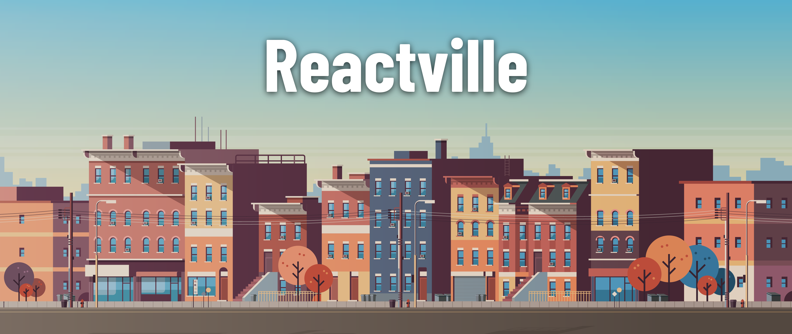
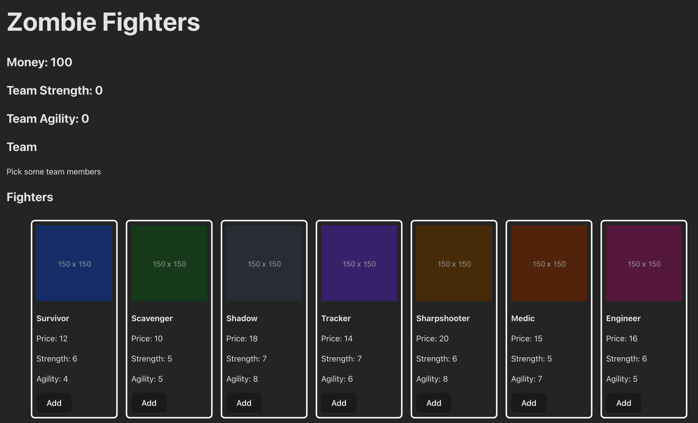

<!-- ! Do not delete or rename this file! -->
<h1>
  
  React State Management Lab
</h1>

## About

Welcome to Reactville, a constantly evolving virtual metropolis. Let's build this digital town together, one component at a time.

Reactville is on high alert! As bizarre rumors turn into chilling reality, the city council has called for immediate action to safeguard the town and its inhabitants - against a looming zombie apocalypse!

Your mission is to strategically assemble a survival team, handpicking members from the city’s diverse population, each bringing their unique skills and quirks. As the city's newly appointed Survival Strategist, you will manage your team's skills, resources, and stats.

In this lab, you'll utilize React's state management to add and remove team members, track essential resources, and monitor your team's overall readiness. This isn't just about surviving; it's about making dynamic UI updates and understanding the inner workings of React state through a fun and engaging simulation.

## Content

- [Setup](../setup/README.md)
- [Exercise](../exercise/README.md)
